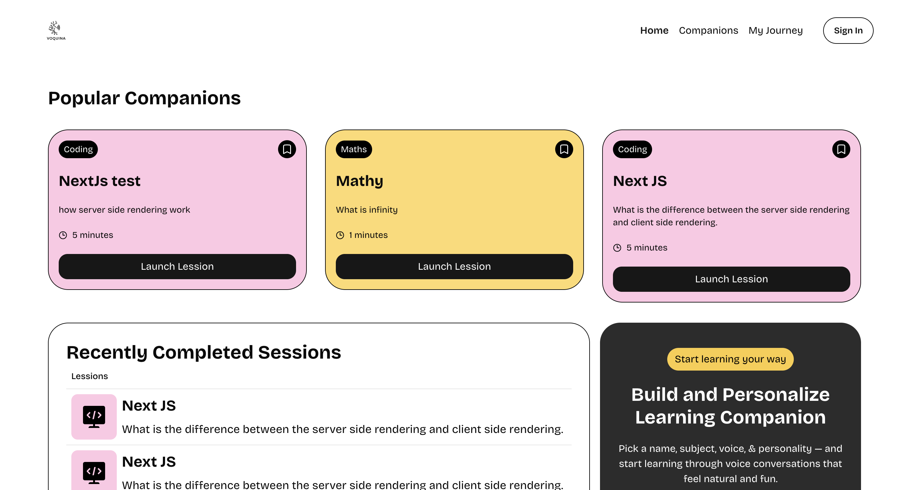
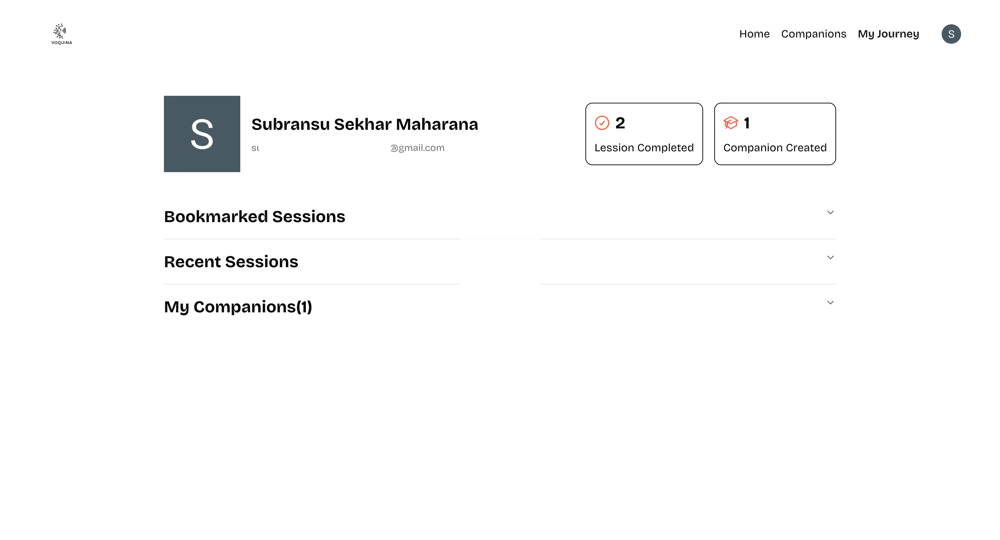
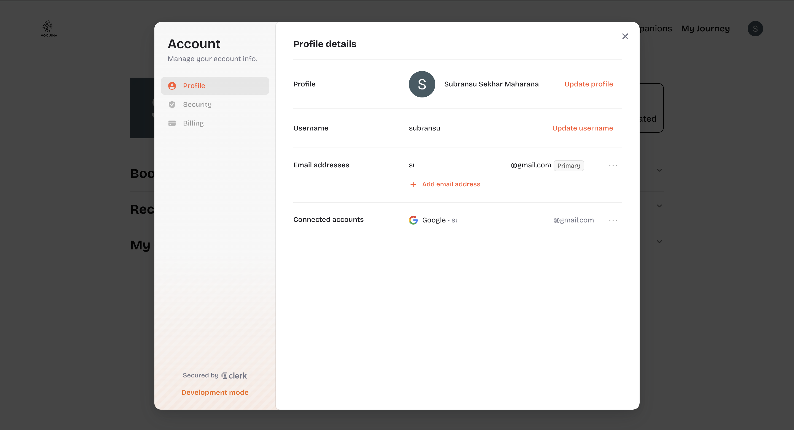

# Voquina – AI Learning Companion 📚🧠

Voquina is a modern **AI-powered Learning Management System (LMS)** SaaS application built from scratch to empower learners through interactive, real-time sessions. Featuring a conversational **voice AI agent**, robust **subscription management**, and a seamless **learning experience**, Voquina is your smart companion in education.

---

## 🚀 Features

- 🔐 **User Authentication** using Clerk
- 💳 **Subscriptions & Payments** via Stripe
- 🧠 **Real-Time Learning Sessions** with Vapi (Voice AI)
- 📈 **Usage Tracking & Monitoring** using Sentry
- 🖼️ **Polished UI Components** with shadcn/ui
- 🧾 **Database & APIs** managed via Supabase
- 🎨 **Modern UI Design** using Tailwind CSS
- ✅ **Schema Validation** with Zod
- 🔧 **Type-Safe Development** using TypeScript
- ⚡ **Blazing Fast Performance** with Next.js

---

## 🧩 Tech Stack

| Tech        | Purpose                                                                                       |
|-------------|-----------------------------------------------------------------------------------------------|
| **Next.js** | Framework for SSR, API routes, and full-stack development                                     |
| **Clerk**   | Authentication, user management, billing & subscription control                               |
| **Stripe**  | Secure and flexible payment processing                                                        |
| **Supabase**| Backend-as-a-service (BaaS) for real-time data, auth, storage, and Postgres DB                |
| **Vapi**    | AI voice interface for real-time, multilingual, low-latency conversations                     |
| **Tailwind CSS** | Utility-first CSS framework for flexible, rapid UI development                          |
| **shadcn/ui** | Pre-built components built on Radix UI and Tailwind CSS for polished UI design             |
| **Sentry**  | Error tracking and performance monitoring in real time                                        |
| **Zod**     | Runtime schema validation for APIs and forms                                                  |
| **TypeScript** | Strong typing system for safer and scalable code                                           |

---





## 📦 Installation

1. **Clone the Repository**
   ```bash
   git clone https://github.com/Subhransu9889/voquina_app
   cd voquina

## 💖 Built with Love

Crafted passionately using **Next.js**, **Supabase**, **Stripe**, and a touch of **AI magic** ✨  
This project is open-source and made to inspire learning and creation.  
Made with 💻 + ❤️ by Subransu
